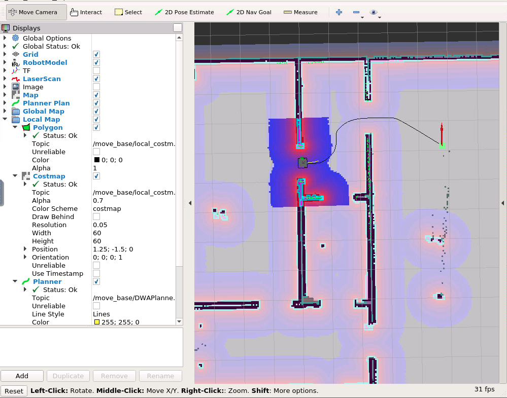
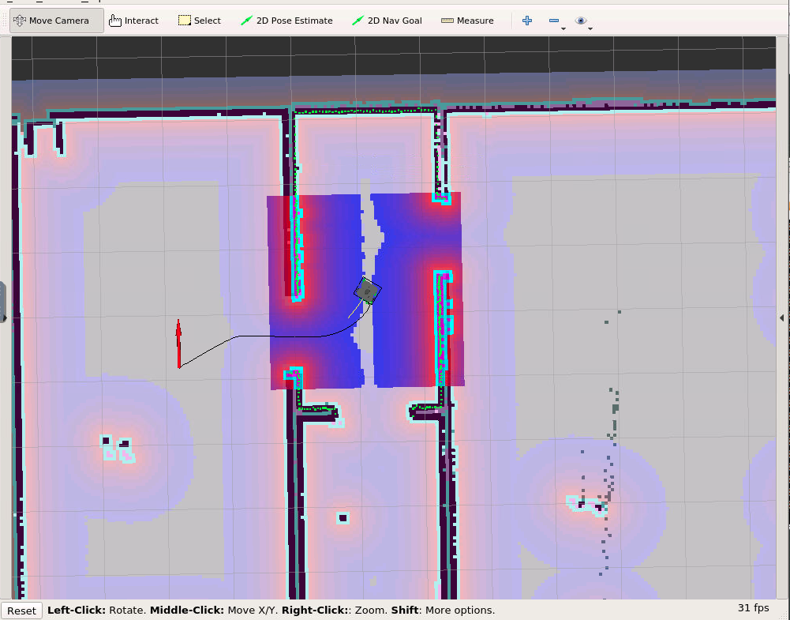
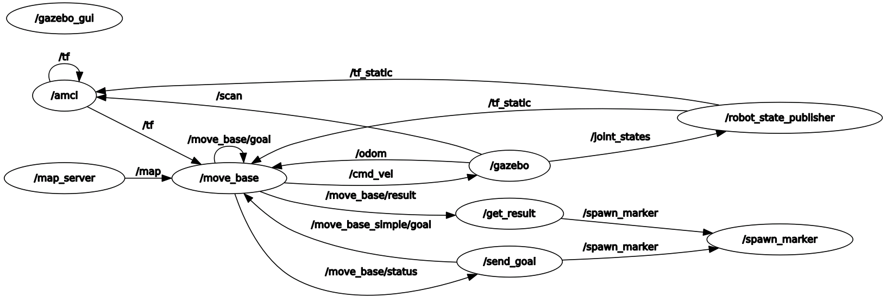

# udacity_map_my_world_package
Final project for Udacity's Robotics Software Engineer Nanodegree Program
#### Goals

* Use the ROS and manually command the robot using the 2D Navigation move_base and navigation stack to move to 2 different desired positions and orientations.
* Create a pick_objects(cube) node that commands the robot to move to the desired pickup point and drop off point.


#### Requirements
```
sudo apt-get update
sudo apt-get install xterm
sudo apt-get install ros-kinetic-turtlebot*
```
#### build package
```
cd ~/Desktop
mkdir -p ~/Desktop/turtleworld/src
cd ~/Desktop/turtleworld/src
git clone https://github.com/mantues/udacity_home_service_robot_package
git clone -b indigo  https://github.com/turtlebot/turtlebot_simulator.git
git clone -b kinetic https://github.com/turtlebot/turtlebot.git
cd ~/Desktop/turtleworld
rosdep install -y --from-paths src --ignore-src --rosdistro kinetic
catkin_make
source ~/Desktop/turtleworld/devel/setup.bash
```


## To test SLAM-package(ROS-kinetic-package)
```
bash test_sram.sh
```


## To test Navigation-package(ROS-kinetic-package)
```
bash test_navigation.sh
```
## To spawn cube in Rviz(ROS-kinetic-package)
```
bash add_markers.sh
```
---
## Home robot service package(ROS-kinetic-package)

```
bash pick_object.sh
```
Wherever the robot is, a cube will appear at your destination and the robot can use the navigation package to get to it.




After 5 seconds, the cube will disappear and you will move to the next destination.
When the movement is finished, the cube will appear.




---
## Structure
```
udacity_robot_ball_chaser_kinetic_package
├── myrobot
│   ├── CMakeLists.txt
│   ├── configuration_files
│   │   ├── base_local_planner_params.yaml
│   │   ├── costmap_common_params.yaml
│   │   ├── global_costmap_params.yaml
│   │   ├── local_costmap_params.yaml
│   │   └── move_base_params.yaml
│   ├── launch
│   │   ├── amcl.launch
│   │   ├── gmapping.launch
│   │   ├── nav_world.launch
│   │   ├── robot_description.launch
│   │   ├── teleop.launch
│   │   └── world.launch
│   ├── maps
│   │   ├── map_g.pgm
│   │   └── map_g.yaml
│   ├── meshes
│   │   └── hokuyo.dae
│   ├── package.xml
│   ├── rviz
│   │   ├── gmapping.rviz
│   │   ├── udacity_movebase.rviz
│   │   └── udacity.rviz
│   ├── urdf
│   │   ├── myrobot.gazebo
│   │   └── myrobot.xacro
│   └── worlds
│       ├── empty.world
│       └── Udacity_office.world
├── README.md
└── teleop_twist_keyboard
    ├── CHANGELOG.rst
    ├── CMakeLists.txt
    ├── package.xml
    ├── README.md
    └── teleop_twist_keyboard.py
```
## rqt-graph




---

## Functional description of each node
### Node [/get_result]
#### Subscribe the goal topic[/move_base/result]. Publish the coordinates to spawn the cube.
    Publications: 
    * /get_result [std_msgs/String]
    * /spawn_marker [std_msgs/Float32MultiArray]

    Subscriptions: 
    * /clock [rosgraph_msgs/Clock]
    * /move_base/result [move_base_msgs/MoveBaseActionResult]


### Node [/spawn_marker]
#### It receives the topic[/spawn_marker] and spawns a cube at the corresponding coordinates.


    Publications: 
    * /visualization_marker [visualization_msgs/Marker]

    Subscriptions: 
    * /clock [rosgraph_msgs/Clock]
    * /spawn_marker [std_msgs/Float32MultiArray]

### Node [/send_goal]
#### Spawn the cube to the initial destination. Publish the destination.
    Publications: 
    * /move_base_simple/goal [geometry_msgs/PoseStamped]
    * /spawn_marker [std_msgs/Float32MultiArray]

    Subscriptions: 
    * /clock [rosgraph_msgs/Clock]
    * /move_base/status [actionlib_msgs/GoalStatusArray]

